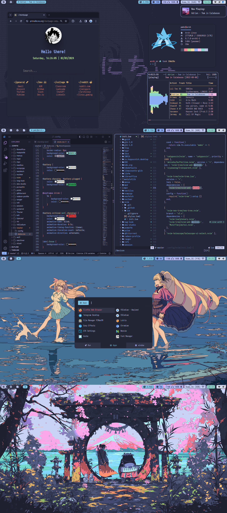

<h3 align="center">
  <b>Hyprland dotfiles</b>
</h3> 

<h1>
  <a href="#--------">
  </a>
</h1>

<p align="center">
  <a href="https://github.com/primalkz/hyprland_dots/stargazers"></a>
  <a href="https://github.com/primalkz/hyprland_dots/issues"></a>
</p>

</br>


Hey, Thanks for dropping by.... This is my personal setup of hyrpland Window Manager and other utilities.

- Window Manager: [hyprland](https://github.com/hyprwm/Hyprland)
- Text Editor: [Neovim](https://github.com/neovim)
- Music Player: Mpv or Ncmpcpp
- Bar:  [Waybar](https://github.com/Alexays/Waybar)
- Shell: [starship](https://starship.rs/)
- notification daemon: [dunst](https://github.com/dunst-project/dunst)
- GUI Editor: [Vscode](https://github.com/microsoft/vscode)
- Terminal Emulator: [foot](https://codeberg.org/dnkl/foot), [Alacritty](https://github.com/alacritty/alacritty)
- App Launcher: [Rofi ibonn wayland fork](https://github.com/lbonn/rofi)
- Startpage: [startpage-catppuccin](https://github.com/primalkz/startpage-catppuccin)

## Previews

<details>
<summary>Screenshot</summary>

</details>


## Fonts
- Iosevka (IosevkaTermSlab Nerd Font & Iosevka Mayukai Codepro)
- Madness.ttf
- font-awesome
- Material Design Icons


</br>
</br>

# Installation 
  - Clone this repository to your $HOME dir. 
  > After you're done with cloning the repository. Install the following packages 
  
  ```hyprland waybar rofi foot alacritty hyprpicker azote maim ranger ncmpcpp mpd wofi.``` 
  > Don't forget to copy fonts/ to your ~/.local/share/fonts/ directory.
 
  > After you're done with all this, copy the configuration files from cloned directory to particular path. 

# Credits and more.. 
- [Catppuccin](https://github.com/catppuccin/catppuccin) colorscheme which I've used in my rice. 
- I am using [IosevkaTermSlab font](https://github.com/ryanoasis/nerd-fonts/releases/download/v3.1.1/IosevkaTermSlab.zip) and a Custom font called [Iosevka Mayukai](https://github.com/Iosevka-Mayukai/Iosevka-Mayukai).
- I'm using an utility called [azote](https://github.com/nwg-piotr/azote) to change wallpapers.
- My other Dotfiles can be found in the [bspwm-dots](https://github.com/primalkz/bspwm-dots), [xmonad](https://github.com/primalkz/xmonad) and [DWM source files](https://github.com/primalkz/suckless).

# Thank You 
